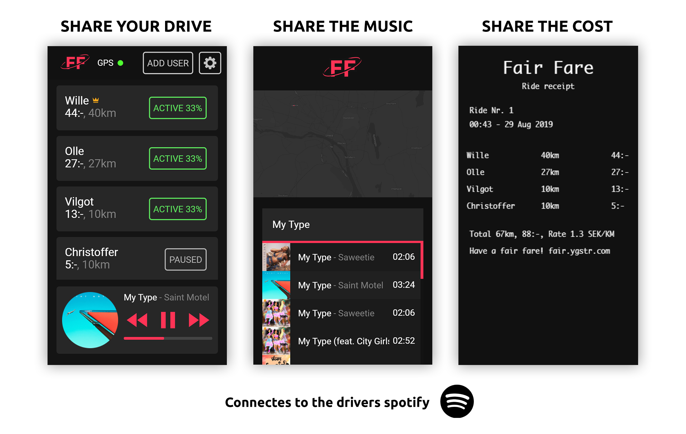

## Share the fuel cost among all the riders fairly

### Share fuel cost
Activate the users that should be paying for the current driving. The GPS tracks how many
miles that person rides, and how much those miles cost. If more than one person is activated, they
will share the cost. Set a flat rate for how much each mile should cost and recieve a reciept at the end of the ride.

### Connect to spotify
The driver can connect to their premium spotify account. 
That allows passengers to search spotify library and play and queue songs from their own phones.

### Broadcast your trip
If you choose to broadcast your trip, you get a link / code that you can send to your friends.
This allows them to see where you are on a map.
